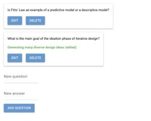
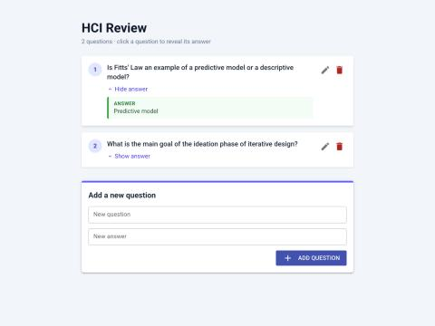
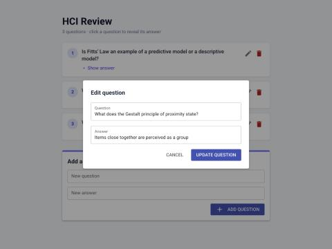

# CS/IT 760 – Homework 3: UIs and APIs

**Name:** ______________________

**Repository:** https://github.com/Iscolering/HCI-HW3

**How to run:** `pip install nicegui requests uvicorn pydantic fastapi`, then run `python api.py` in one terminal and `python ui.py` in another, and open http://localhost:8084.

## Part 1: Reading the code

### Fully implemented routes in api.py

The API is a FastAPI app served by uvicorn on port 8005, so every route is reached at `http://localhost:8005` followed by the route's path. CORS middleware allows any origin, method and header, so a frontend on a different port (the NiceGUI UI on port 8084) is allowed to call it. The questions are kept in memory in a Python list, `questions`, where each item is a dictionary with an `id`, a question `q` and an answer `a`. The data resets every time the API restarts.

**1. GET /questions** (URL: `http://localhost:8005/questions`)

- **Purpose:** returns the whole `questions` list as JSON. Each item looks like `{"id": 0, "q": "...", "a": "..."}`.
- **Use by a frontend:** this is the read operation. A UI calls it whenever it needs the current data, for example on first load and after every change. It then loops over the returned list to draw one element per question. It takes no parameters and no request body.

**2. POST /add** (URL: `http://localhost:8005/add`)

- **Purpose:** creates a new question. The request body must be JSON that matches the `QuestionRequest` Pydantic model, `{"question": "<text>", "answer": "<text>"}`. FastAPI checks the body and returns a 422 error if a field is missing or isn't a string. The route then appends a new dictionary `{"id": ..., "q": question, "a": answer}` to the list. It returns nothing, so the response body is `null` with status 200.
- **Use by a frontend:** a form with question and answer inputs sends this request when the user submits it. The UI then re-fetches `/questions` to show the new item. In the starter code, the new id was `len(questions)`, which produces duplicate ids once questions can be deleted. I changed it to `max(id) + 1` in Part 2.

The starter file also had stubs for `DELETE /delete/{id}` and `PUT /update/{id}`. They only contained `pass`, so they were not fully implemented. They are implemented in Part 2 (see below).

### API calls in ui.py

The UI never touches the data directly. It always goes through two small wrapper functions. `api_get(path)` calls `requests.get(API_URL + path, timeout=5)`. `api_post(path, data)` calls `requests.post(API_URL + path, json=data, timeout=5)`. Both call `raise_for_status()` so that HTTP error codes count as failures. On any `RequestException` (connection refused, timeout, 4xx or 5xx), they show a red `ui.notify` toast and return a safe fallback (`[]` or `False`) instead of crashing the UI. The starter code uses these wrappers in two places.

**1. `api_get("/questions")` inside `render_page()`**

- **What happens:** sends `GET http://localhost:8005/questions`. The decoded JSON list replaces the global `questions` variable. `render_page()` then clears `page_body` and rebuilds one card per question, plus the input form. While doing this, it attaches a local UI-only `state` dictionary (`show_answer: False`) to each question.
- **Effect:** the screen always shows the latest copy of the server's data. The API is the single source of truth, and the UI only holds a temporary copy of it.
- **Why it's needed here:** `render_page()` runs on first load (`init_page()`) and after every change, such as adding a question. Without a fresh GET, the UI would show old data after a change, because the change happened on the server and not in the UI's local list. If the API can't be reached, the empty-list fallback means the page still renders (just without questions) and the user sees an error toast.

**2. `api_post("/add", {"question": question, "answer": answer})` inside `add_new_question()`**

- **What happens:** when the user clicks "Add question", the button's `on_click` lambda reads the current values of the two input fields and calls `add_new_question`. That function sends them as a JSON body in `POST http://localhost:8005/add`.
- **Effect:** the server appends the new question to its list. The question now exists for every client and survives page reloads (until the API restarts).
- **Why it's needed here:** the UI's `questions` list is only a copy. Appending to it locally would not save anything, and the next `render_page()` would overwrite it anyway. The POST is the only way to change the shared data. Right after it, `add_new_question` calls `render_page()`, which does the GET above so the new question appears.

(After Parts 3 and 4, `ui.py` also uses `api_delete("/delete", id)` → `DELETE /delete/{id}`, and `api_put("/update", id, data)` → `PUT /update/{id}`. They follow the same pattern: send the change to the server, then call `render_page()` to fetch the data again and redraw the page.)

## Parts 2–4: Implementation summary

- **api.py:** `DELETE /delete/{id}` and `PUT /update/{id}` use a helper, `find_question(id)`. It raises `HTTPException(status_code=404, detail="Question with ID {id} not found")` when the id doesn't exist. The delete route removes the dictionary from the list. The update route overwrites `q` and `a` with the values from `QuestionRequest` and returns the updated question. I also changed `/add` so ids stay unique after a delete.
- **ui.py:** `api_delete` and `api_put` follow the same structure as `api_get` and `api_post` (`requests.delete` / `requests.put` on `f"{API_URL}{path}/{id}"`, and `json=data` for the PUT). `render_question` now adds an Edit and a Delete button to each card. Each button's `on_click` lambda captures that card's own `question`, so it only affects that one question. Delete calls `api_delete` and then `render_page()`. Edit opens a `ui.dialog` with two textareas labeled "Question" and "Answer", pre-filled with the current values. Its "Update question" button closes the dialog, sends the PUT and re-renders the page (the lambda list from the handout).
- **Bug fixes found along the way:** `toggle_answer` used to look questions up with `questions[id]`. After a delete, list positions no longer match ids, so this toggled the wrong card or crashed. It now toggles the question object directly. Only the question's text area toggles the answer, so clicking Edit or Delete doesn't also show or hide it.

Every flow (add, reveal/hide, edit, delete, 404 for unknown ids) was tested against the running API and UI.

## Part 5: UI improvements

### Gestalt principles in the original design

- **Common region:** each question is drawn inside a `ui.card`. The card's border and shadow make the question, its answer and its buttons read as one unit. This is the strongest Gestalt cue in the original design.
- **Proximity:** the answer appears directly under its question, inside the same card, so the two are seen as a pair. The two text inputs and the "Add question" button are stacked close together, so they read as one form.
- **Similarity:** all question cards look the same, so users see them as items of the same kind. However, every button (Edit, Delete and Add question) uses the same blue filled style. Similarity therefore suggests they are the same kind of action. In fact, Delete is destructive and Add question is a main page-level action.
- **Figure/ground:** white cards on a white page are separated only by a faint shadow, so the figure/ground contrast is weak.

**Where it falls short:**

1. Card widths depend on how long the text is, so the right edges are ragged and the list does not read as one continuous column (continuity and alignment).
2. The add form has no boundary or heading. It sits at the same distance from the last card as the cards are from each other, so by proximity it looks like another list item.
3. Nothing indicates that a card can be clicked to reveal the answer (missing signifier).
4. The page has no title or visual hierarchy.
5. Edit and Delete have the same visual weight as the content and as each other.

### Design changes (9) and justifications

1. **Light grey page background (`bg-slate-100`) behind white cards.** *Figure/ground:* the cards (the content) now clearly stand out from the background, which improves scanning (NN/g, "Gestalt Principles for Visual UI Design"; course lecture on visual design).
2. **One centered column with a maximum width (`max-w-2xl mx-auto`) and consistent padding and gaps.** *Alignment and continuity:* every element shares the same left and right edges, so the eye follows a single vertical path. The limited width also keeps lines to a readable length, roughly 50–75 characters (Baymard Institute, "Readability: The Optimal Line Length").
3. **All question cards are full width (`w-full`) with equal spacing (`gap-4`).** *Similarity and continuity:* cards that look the same and line up read as one ordered list instead of separate blocks. The space inside a card is smaller than the space between cards. By *proximity*, each question therefore groups with its own answer and buttons, not with the neighboring card.
4. **Numbered badges (1, 2, 3…) at the left of each card.** These give each item a clear starting point and make the list easy to scan and refer to ("question 2"). Coloring the badges the same also strengthens *similarity* across the list. Text is left-aligned so readers can follow the F-shaped scanning pattern (NN/g, "F-Shaped Pattern of Reading on the Web").
5. **A "Show answer / Hide answer" label with a chevron, plus a pointer cursor and hover shadow on the card.** Norman's *signifiers* and *feedback*: in the original, nothing showed that the card could be clicked. The label and the arrow, which flips when opened, make the hidden action visible and confirm the state change (Norman, *The Design of Everyday Things*; Nielsen heuristic #1, visibility of system status).
6. **The answer appears in its own tinted box with a green left border and a small "ANSWER" label.** *Common region and connectedness:* the box visually attaches the answer to the question above it and separates it from the question text. Users no longer have to rely on color alone (green text) to tell question and answer apart, which also helps color-blind users (WCAG 1.4.1, Use of Color).
7. **Edit and Delete are small icon buttons grouped at the right edge of each card, with tooltips. Delete is red; Edit is neutral grey.** *Proximity:* the two actions form their own cluster, separate from the content. *Similarity with a purposeful difference:* red marks Delete as destructive and follows a familiar convention (NN/g, "Using Color to Enhance Your Design"). Low-emphasis icon buttons keep the content as the main figure, in line with *aesthetic and minimalist design* (Nielsen heuristic #8). Tooltips give the text labels, so the icons do not have to be guessed (recognition rather than recall, heuristic #6).
8. **The add form is placed in its own titled card ("Add a new question") with an indigo top accent, outlined full-width inputs and a right-aligned primary button with a "+" icon.** *Common region:* the form is now clearly a different section from the list. Extra top margin separates them (*proximity*). The accent color is the same as the primary buttons and badges, which links all "actions you can take" (*similarity*). Empty question or answer fields are rejected with a warning instead of being saved as blank questions (*error prevention*, heuristic #5).
9. **A page title ("HCI Review") with a subtitle that shows the question count and how to use the page.** *Visual hierarchy:* size and weight contrast creates a clear entry point and tells users what the page is for before they reach the content (NN/g, "Visual Hierarchy in UX"). A "Question deleted" toast and an empty-state message ("No questions yet…") give feedback after actions (*visibility of system status*, heuristic #1).

**Edit dialog.** The dialog also got a title, outlined auto-growing textareas, a Cancel button (*user control and freedom*, heuristic #3) and a right-aligned primary "Update question" button. This matches the button placement used in the add form.

**Sources:** NN/g, "The Gestalt Principles for User Interface Design" (video) and "Gestalt Principles for Visual UI Design"; J. Nielsen, "10 Usability Heuristics for User Interface Design" (NN/g); D. Norman, *The Design of Everyday Things* (2013); NN/g, "Visual Hierarchy in UX"; NN/g, "F-Shaped Pattern of Reading on the Web"; Baymard Institute, "Readability: The Optimal Line Length"; W3C WCAG 2.2, Success Criterion 1.4.1; CS/IT 760 lecture on visual design.

## AI usage statement

As the assignment's experiment directed, **every part of this assignment (Parts 1–5) was completed with AI**. I used Claude Code (Anthropic's Claude Opus 5.5 model, in the Claude desktop app). I gave it the assignment text and my forked repository. The AI:

- read `api.py` and `ui.py` and wrote the Part 1 explanations;
- wrote the DELETE and PUT routes (Part 2), the `api_delete` and `api_put` functions, the delete and edit buttons and the edit dialog (Parts 3–4);
- found and fixed two bugs in the starter code (duplicate ids after a delete; `toggle_answer` indexing by id);
- wrote the Part 5 Gestalt analysis, made the 9 styling changes and wrote their justifications;
- ran the API and the UI, tested every interaction in a browser (adding, revealing, editing, deleting, 404 handling) and took the screenshots in this report;
- committed the work to git (one commit each for Part 2, Parts 3–4 and Part 5) and produced this PDF.

The cited sources come from the AI's general knowledge of well-known HCI references. They were not looked up again during this session.
